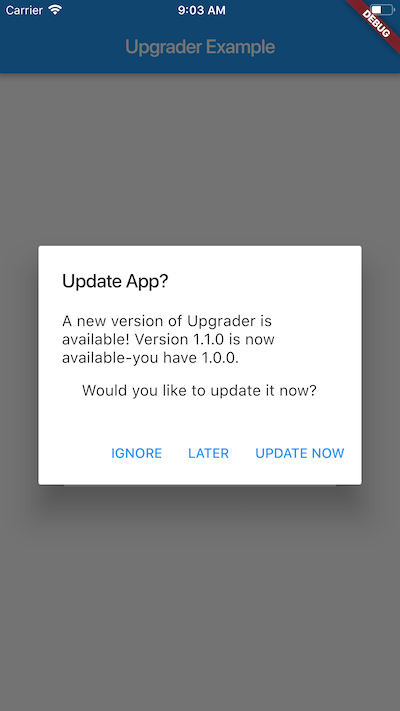
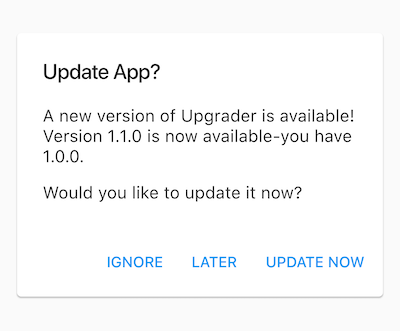
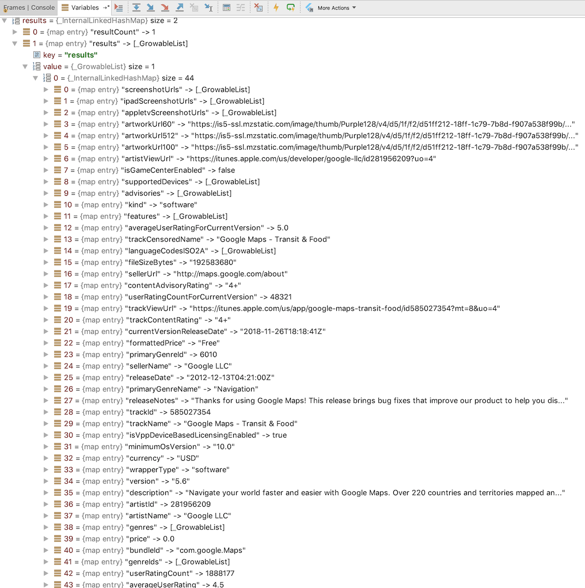

# Upgrader

Flutter package for prompting users to upgrade when there is a newer version of the app in the store.

[](https://travis-ci.org/larryaasen/upgrader)
[](https://circleci.com/gh/larryaasen/upgrader)
[](https://codecov.io/gh/larryaasen/upgrader)
[](https://pub.dartlang.org/packages/upgrader)

[Become a Patron!](https://www.patreon.com/bePatron?u=15315667)

When a newer app version is availabe in the app store, a simple alert prompt widget or card is
displayed. With today's modern app stores, there is little need to persuade users to upgrade
because most of them are already using the auto upgrade feature. However, there may be times when
an app needs to be updated more quickly than usual, and nagging a user to upgrade will entice
the upgrade sooner. Also, with Flutter supporting more than just Android and iOS app stores in the
future, it will become more likely that users on other app stores need to be nagged about
upgrading.

The UI comes in two flavors: alert or card. The [UpgradeAlert](#alert-example) class is used to display the
popup alert prompt, and the [UpgradeCard](#card-example) class is used to display the inline material design card.

## Alert Example

Just wrap your body widget in the UpgradeAlert widget, and it will handle the rest.
```dart
import 'package:flutter/material.dart';
import 'package:upgrader/upgrader.dart';

void main() => runApp(MyApp());

class MyApp extends StatelessWidget {
  MyApp({
    Key key,
  }) : super(key: key);

  @override
  Widget build(BuildContext context) {
    return MaterialApp(
      title: 'Upgrader Example',
      home: Scaffold(
          appBar: AppBar(
            title: Text('Upgrader Example'),
          ),
          body: UpgradeAlert(
            child: Center(child: Text('Checking...')),
          )
      ),
    );
  }
}
```

## Screenshot of alert




## Card Example

Just return an UpgradeCard widget in your build method and a material design card will be displayed
when an update is detected. The widget will have width and height of 0.0 when no update is detected.
```dart
return Container(
        margin: EdgeInsets.fromLTRB(12.0, 0.0, 12.0, 0.0),
        child: UpgradeCard());
```

## Screenshot of card



## Customization

The UpgradeAlert widget can be customized by setting parameters in the constructor of the
UpgradeAlert widget.

* appcastConfig: the appcast configuration, defaults to ```null```
* buttonTitleIgnore: the ignore button title, which defaults to ```Ignore```
* buttonTitleLater: the later button title, which defaults to ```Later```
* buttonTitleUpdate: the update button title, which defaults to ```Update Now```
* client: an HTTP Client that can be replaced for mock testing, defaults to ```null```
* daysUntilAlertAgain: days until alerting user again, which defaults to ```3```
* debugDisplayAlways: always force the upgrade to be available, defaults to ```false```
* debugDisplayOnce: display the upgrade at least once once, defaults to ```false```
* debugLogging: display logging statements, which defaults to ```false```
* onIgnore: Called when the ignore button is tapped, defaults to ```null```
* onLater: Called when the later button is tapped, defaults to ```null```
* onUpdate: Called when the update button is tapped, defaults to ```null```
* prompt: the call to action message, which defaults to ```Would you like to update it now?```
* title: the alert dialog title, which defaults to ```Update App?```
* showIgnore: hide or show Ignore button on dialog, which defaults to ```true```
* showLater: hide or show Later button on dialog, which defaults to ```true```
* canDismissDialog: can alert dialog be dismissed on tap outside of the alert dialog, which defaults to ```false``` (not used by alert card)

## Limitations
These widgets work on both Android and iOS. When running on iOS the App Store will provide the
latest app version and will display the prompt at the appropriate times.

On Android, this widget
does nothing as there is no easy way to query the Google Play Store for metadata about an app.
Without the metadata, the widget cannot compare the app version with the latest Play Store version.
It will not disrupt the widget tree and can be
included in an Android without any issues.

There is now an [appcast](#appcast) that can be used for Android and iOS to remotely configure the
latest app version.

## Appcast

The class [Appcast](lib/src/appcast.dart), in this Flutter package, is used by the Upgrader widgets
to download app details from an appcast,
based on the [Sparkle](https://sparkle-project.org/) framework by Andy Matuschak.
You can read the Sparkle documentation here:
https://sparkle-project.org/documentation/publishing/.

An appcast is an RSS feed with one channel that has a collection of items that each describe
one app version. The appcast will decscribe each app version and will provide the latest app
version to Upgrader that indicates when an upgrade should be recommended.

The appcast must be hosted on a server that can be reached by everyone from the app. The appcast
XML file can be autogenerated during the release process, or just manually updated after a release
is available on the app store.

The Appcast class can be used stand alone or as part of Upgrader.

### Appcast Example
```dart
final appcast = Appcast();
final items = await appcast.parseAppcastItemsFromUri('https://raw.githubusercontent.com/larryaasen/upgrader/master/test/testappcast.xml');
final bestItem = appcast.bestItem();
```

### Appcast Sample File
```xml
<?xml version="1.0" encoding="utf-8"?>
<rss version="2.0" xmlns:sparkle="http://www.andymatuschak.org/xml-namespaces/sparkle">
    <channel>
        <title>Debt Now App - Appcast</title>
        <item>
            <title>Version 1.15.0</title>
            <description>desc</description>
            <pubDate>Sun, 30 Dec 2018 12:00:00 +0000</pubDate>
            <enclosure url="https://play.google.com/store/apps/details?id=com.moonwink.treasury" sparkle:version="1.15.0" sparkle:os="android" />
        </item>
    </channel>
</rss>
```

## iTunes Search API

There is a class in this Flutter package used by the upgrader widgets to download app details 
from the
[iTunes Search API](https://affiliate.itunes.apple.com/resources/documentation/itunes-store-web-service-search-api).
The class ITunesSearchAPI can be used standalone to query iTunes for app details.

### ITunesSearchAPI Example
```dart
final iTunes = ITunesSearchAPI();
final resultsFuture = iTunes.lookupByBundleId('com.google.Maps');
resultsFuture.then((results) {
    print('results: $results');
});
```

### Results
[](screenshots/results.png)

### Command Line App
There is a command line app used to display the results from iTunes Search. The code is located in
bin/itunes_lookup.dart, and can be run from the command line like this:
```
$ dart itunes_lookup.dart bundleid=com.google.Maps
```
Results:
```
upgrader: download: https://itunes.apple.com/lookup?bundleId=com.google.Maps
upgrader: response statusCode: 200
itunes_lookup bundleId: com.google.Maps
itunes_lookup trackViewUrl: https://apps.apple.com/us/app/google-maps-transit-food/id585027354?uo=4
itunes_lookup version: 5.31
itunes_lookup all results:
{resultCount: 1, results: 
...
```

## Contributing
All [comments](https://github.com/larryaasen/upgrader/issues) and [pull requests](https://github.com/larryaasen/upgrader/pulls) are welcome.

[Become a Patron!](https://www.patreon.com/bePatron?u=15315667)
